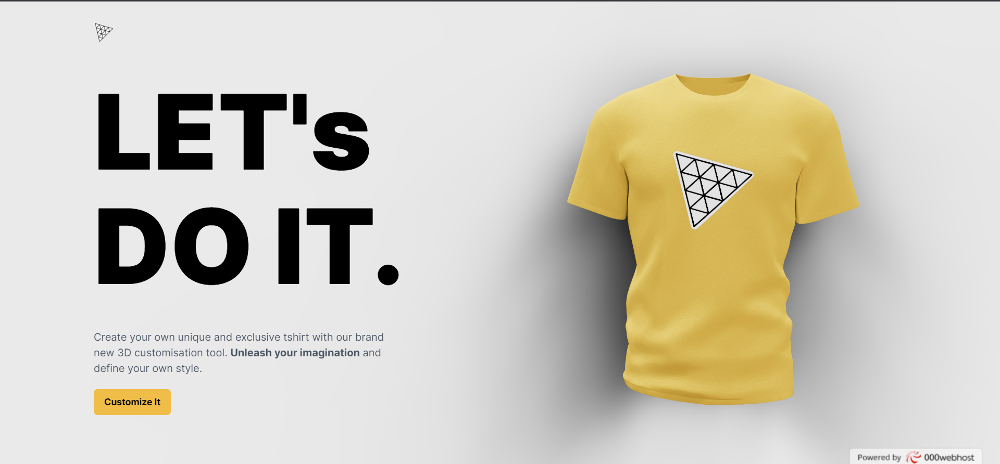
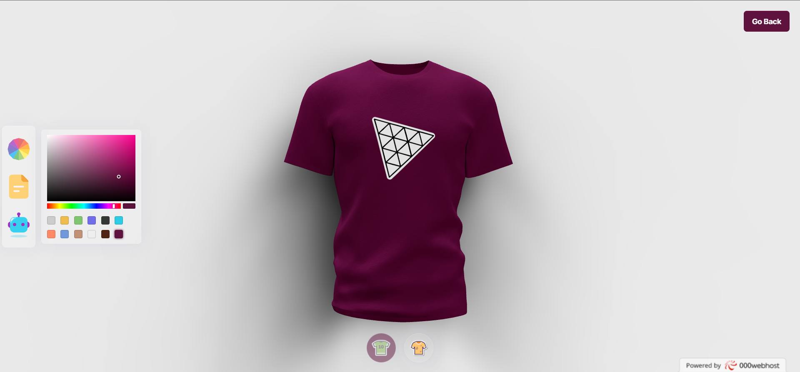

# AI-Powered 3D Website Using React

This is a 3D website that allows users to customize a Tshirt and upload their own images to it. The website uses the OpenAI DALLE API to generate images from text captions. The website is built using React, ThreeJS, React Three Fiber, TailwindCSS, Framer Motion, and ExpressJS.

## Table of contents

- [Overview](#overview)
  - [The challenge](#the-challenge)
  - [Screenshot](#screenshot)
  - [Links](#links)
- [My process](#my-process)
  - [Built with](#built-with)
  - [What I learned](#what-i-learned)
  - [Useful resources](#useful-resources)
- [Author](#author)

## Overview

### The challenge

Users should be able to:

- View 3D model of Tshirt
- Customize the Tshirt
- Upload custom image to the Tshirt
- View the optimal layout for the site depending on their device's screen size
- See hover states for all interactive elements on the page

### Screenshot

### Links

- Solution URL: [Github Code](https://github.com/AshwanthramKL/CustomTshirt_Website)
- Live Site URL: [CustomTshirt Website](https://trifoliate-manual.000webhostapp.com/)

## My process

### Built with

- [React](https://reactjs.org/) - JS library

- [ThreeJS](https://threejs.org/) - a powerful 3D graphics library for rendering and animating the 3D model

- [React Three Fiber](https://docs.pmnd.rs/react-three-fiber/) - a popular library for creating 3D graphics with ThreeJS in React

- [TailwindCSS](https://tailwindcss.com/) - a popular utility-first CSS styling framework

- [Framer Motion](https://www.framer.com/motion/) - the most popular library used to bring your React website to life with animations

- [OpenAI DALLE](https://openai.com/blog/dall-e/) - a neural network that generates images from text captions for a wide range of concepts expressible in natural language

- [React Image Crop](https://www.npmjs.com/package/react-image-crop) - a popular library for cropping images in React

- [ExpressJS](https://expressjs.com/) - a popular NodeJS framework for building web applications

### What I learned

- Load, create and customize stunning 3D models and geometries with various lights, as well as understand the 3D world with a camera and positioning of an object in space.
- Make your code reusable and scalable using Higher Order Components (HOCs) and other industry-standard best practices
- Add custom color and file support.
- Generate and use images through DALLE AI
- Ensure responsiveness across all devices and improve your site's performance

### Useful resources

- [React Three Fiber Docs](https://docs.pmnd.rs/react-three-fiber/)

- [ThreeJS Docs](https://threejs.org/).

- [OpenAI Platform API](https://platform.openai.com/docs/introduction)

## Author

- Website - [MARTIALEAGLE](https://github.com/AshwanthramKL)
- Frontend Mentor - [@AshwanthramKL](https://www.frontendmentor.io/profile/AshwanthramKL)
- Twitter - [@AshwanthramKL](https://www.twitter.com/AshwanthramKL)
